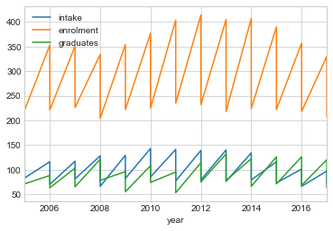

```python
#Source: 
#https://data.gov.sg/dataset/polytechnics-intake-enrolment-and-graduates-by-course
#Date: 24 July 2019        
        
import pandas as pd
import numpy as np
import matplotlib.pyplot as plt
%matplotlib inline
plt.style.use('seaborn-whitegrid')
poly=pd.read_csv("polytechnics-intake-enrolment-and-graduates-by-course.csv")
```


```python
poly.info()
#Memory 14.7 KB to 12.7KB - 13.6% reduction in memory size
```

    <class 'pandas.core.frame.DataFrame'>
    RangeIndex: 312 entries, 0 to 311
    Data columns (total 6 columns):
    year         312 non-null int64
    sex          312 non-null object
    course       312 non-null object
    intake       312 non-null int64
    enrolment    312 non-null int64
    graduates    312 non-null int64
    dtypes: int64(4), object(2)
    memory usage: 14.7+ KB


```python
poly["sex"] = poly["sex"].astype("category",inplace=True)
```


```python
poly.info()
```

    <class 'pandas.core.frame.DataFrame'>
    RangeIndex: 312 entries, 0 to 311
    Data columns (total 6 columns):
    year         312 non-null int64
    sex          312 non-null category
    course       312 non-null object
    intake       312 non-null int64
    enrolment    312 non-null int64
    graduates    312 non-null int64
    dtypes: category(1), int64(4), object(1)
    memory usage: 12.7+ KB


```python
poly.set_index(["year"])
```


<div>
<style scoped>
    .dataframe tbody tr th:only-of-type {
        vertical-align: middle;
    }

    .dataframe tbody tr th {
        vertical-align: top;
    }

    .dataframe thead th {
        text-align: right;
    }
</style>
<table border="1" class="dataframe">
  <thead>
    <tr style="text-align: right;">
      <th></th>
      <th>sex</th>
      <th>course</th>
      <th>intake</th>
      <th>enrolment</th>
      <th>graduates</th>
    </tr>
    <tr>
      <th>year</th>
      <th></th>
      <th></th>
      <th></th>
      <th></th>
      <th></th>
    </tr>
  </thead>
  <tbody>
    <tr>
      <th>2005</th>
      <td>MF</td>
      <td>Applied Arts</td>
      <td>1128</td>
      <td>2593</td>
      <td>550</td>
    </tr>
    <tr>
      <th>2005</th>
      <td>F</td>
      <td>Applied Arts</td>
      <td>687</td>
      <td>1538</td>
      <td>302</td>
    </tr>
    <tr>
      <th>2005</th>
      <td>MF</td>
      <td>Architecture, Building &amp; Real Estate</td>
      <td>515</td>
      <td>1466</td>
      <td>425</td>
    </tr>
    <tr>
      <th>2005</th>
      <td>F</td>
      <td>Architecture, Building &amp; Real Estate</td>
      <td>312</td>
      <td>870</td>
      <td>249</td>
    </tr>
    <tr>
      <th>2005</th>
      <td>MF</td>
      <td>Business &amp; Administration</td>
      <td>3483</td>
      <td>10143</td>
      <td>3044</td>
    </tr>
    <tr>
      <th>2005</th>
      <td>F</td>
      <td>Business &amp; Administration</td>
      <td>2389</td>
      <td>7038</td>
      <td>2270</td>
    </tr>
    <tr>
      <th>2005</th>
      <td>MF</td>
      <td>Education</td>
      <td>189</td>
      <td>484</td>
      <td>111</td>
    </tr>
    <tr>
      <th>2005</th>
      <td>F</td>
      <td>Education</td>
      <td>180</td>
      <td>469</td>
      <td>111</td>
    </tr>
    <tr>
      <th>2005</th>
      <td>MF</td>
      <td>Engineering Sciences</td>
      <td>7826</td>
      <td>22462</td>
      <td>6536</td>
    </tr>
    <tr>
      <th>2005</th>
      <td>F</td>
      <td>Engineering Sciences</td>
      <td>2097</td>
      <td>5939</td>
      <td>2005</td>
    </tr>
    <tr>
      <th>2005</th>
      <td>MF</td>
      <td>Health Sciences</td>
      <td>1639</td>
      <td>4962</td>
      <td>1016</td>
    </tr>
    <tr>
      <th>2005</th>
      <td>F</td>
      <td>Health Sciences</td>
      <td>1326</td>
      <td>3971</td>
      <td>877</td>
    </tr>
    <tr>
      <th>2005</th>
      <td>MF</td>
      <td>Humanities &amp; Social Sciences</td>
      <td>81</td>
      <td>83</td>
      <td>0</td>
    </tr>
    <tr>
      <th>2005</th>
      <td>F</td>
      <td>Humanities &amp; Social Sciences</td>
      <td>71</td>
      <td>73</td>
      <td>0</td>
    </tr>
    <tr>
      <th>2005</th>
      <td>MF</td>
      <td>Information Technology</td>
      <td>4122</td>
      <td>11607</td>
      <td>3356</td>
    </tr>
    <tr>
      <th>2005</th>
      <td>F</td>
      <td>Information Technology</td>
      <td>1887</td>
      <td>5065</td>
      <td>1464</td>
    </tr>
    <tr>
      <th>2005</th>
      <td>MF</td>
      <td>Law</td>
      <td>126</td>
      <td>341</td>
      <td>102</td>
    </tr>
    <tr>
      <th>2005</th>
      <td>F</td>
      <td>Law</td>
      <td>83</td>
      <td>221</td>
      <td>71</td>
    </tr>
    <tr>
      <th>2005</th>
      <td>MF</td>
      <td>Mass Communication</td>
      <td>448</td>
      <td>1426</td>
      <td>419</td>
    </tr>
    <tr>
      <th>2005</th>
      <td>F</td>
      <td>Mass Communication</td>
      <td>324</td>
      <td>1029</td>
      <td>282</td>
    </tr>
    <tr>
      <th>2005</th>
      <td>MF</td>
      <td>Natural, Physical &amp; Mathematical Sciences</td>
      <td>1209</td>
      <td>2844</td>
      <td>768</td>
    </tr>
    <tr>
      <th>2005</th>
      <td>F</td>
      <td>Natural, Physical &amp; Mathematical Sciences</td>
      <td>712</td>
      <td>1678</td>
      <td>447</td>
    </tr>
    <tr>
      <th>2005</th>
      <td>MF</td>
      <td>Services</td>
      <td>140</td>
      <td>469</td>
      <td>188</td>
    </tr>
    <tr>
      <th>2005</th>
      <td>F</td>
      <td>Services</td>
      <td>68</td>
      <td>173</td>
      <td>35</td>
    </tr>
    <tr>
      <th>2006</th>
      <td>MF</td>
      <td>Applied Arts</td>
      <td>1300</td>
      <td>3255</td>
      <td>542</td>
    </tr>
    <tr>
      <th>2006</th>
      <td>F</td>
      <td>Applied Arts</td>
      <td>742</td>
      <td>1894</td>
      <td>319</td>
    </tr>
    <tr>
      <th>2006</th>
      <td>MF</td>
      <td>Architecture, Building &amp; Real Estate</td>
      <td>596</td>
      <td>1622</td>
      <td>394</td>
    </tr>
    <tr>
      <th>2006</th>
      <td>F</td>
      <td>Architecture, Building &amp; Real Estate</td>
      <td>342</td>
      <td>955</td>
      <td>233</td>
    </tr>
    <tr>
      <th>2006</th>
      <td>MF</td>
      <td>Business &amp; Administration</td>
      <td>3944</td>
      <td>10869</td>
      <td>3046</td>
    </tr>
    <tr>
      <th>2006</th>
      <td>F</td>
      <td>Business &amp; Administration</td>
      <td>2487</td>
      <td>7225</td>
      <td>2208</td>
    </tr>
    <tr>
      <th>...</th>
      <td>...</td>
      <td>...</td>
      <td>...</td>
      <td>...</td>
      <td>...</td>
    </tr>
    <tr>
      <th>2016</th>
      <td>MF</td>
      <td>Mass Communication</td>
      <td>618</td>
      <td>1920</td>
      <td>701</td>
    </tr>
    <tr>
      <th>2016</th>
      <td>F</td>
      <td>Mass Communication</td>
      <td>457</td>
      <td>1436</td>
      <td>498</td>
    </tr>
    <tr>
      <th>2016</th>
      <td>MF</td>
      <td>Natural, Physical &amp; Mathematical Sciences</td>
      <td>1296</td>
      <td>4302</td>
      <td>1457</td>
    </tr>
    <tr>
      <th>2016</th>
      <td>F</td>
      <td>Natural, Physical &amp; Mathematical Sciences</td>
      <td>789</td>
      <td>2634</td>
      <td>904</td>
    </tr>
    <tr>
      <th>2016</th>
      <td>MF</td>
      <td>Services</td>
      <td>1071</td>
      <td>3482</td>
      <td>1239</td>
    </tr>
    <tr>
      <th>2016</th>
      <td>F</td>
      <td>Services</td>
      <td>479</td>
      <td>1624</td>
      <td>571</td>
    </tr>
    <tr>
      <th>2017</th>
      <td>MF</td>
      <td>Applied Arts</td>
      <td>1885</td>
      <td>5291</td>
      <td>1682</td>
    </tr>
    <tr>
      <th>2017</th>
      <td>F</td>
      <td>Applied Arts</td>
      <td>1147</td>
      <td>3128</td>
      <td>1000</td>
    </tr>
    <tr>
      <th>2017</th>
      <td>MF</td>
      <td>Architecture, Building &amp; Real Estate</td>
      <td>714</td>
      <td>1979</td>
      <td>736</td>
    </tr>
    <tr>
      <th>2017</th>
      <td>F</td>
      <td>Architecture, Building &amp; Real Estate</td>
      <td>390</td>
      <td>1129</td>
      <td>441</td>
    </tr>
    <tr>
      <th>2017</th>
      <td>MF</td>
      <td>Business &amp; Administration</td>
      <td>4834</td>
      <td>14453</td>
      <td>5416</td>
    </tr>
    <tr>
      <th>2017</th>
      <td>F</td>
      <td>Business &amp; Administration</td>
      <td>2931</td>
      <td>8836</td>
      <td>3384</td>
    </tr>
    <tr>
      <th>2017</th>
      <td>MF</td>
      <td>Education</td>
      <td>709</td>
      <td>1618</td>
      <td>320</td>
    </tr>
    <tr>
      <th>2017</th>
      <td>F</td>
      <td>Education</td>
      <td>650</td>
      <td>1503</td>
      <td>307</td>
    </tr>
    <tr>
      <th>2017</th>
      <td>MF</td>
      <td>Engineering Sciences</td>
      <td>6938</td>
      <td>21019</td>
      <td>6615</td>
    </tr>
    <tr>
      <th>2017</th>
      <td>F</td>
      <td>Engineering Sciences</td>
      <td>1481</td>
      <td>4518</td>
      <td>1572</td>
    </tr>
    <tr>
      <th>2017</th>
      <td>MF</td>
      <td>Health Sciences</td>
      <td>2567</td>
      <td>7798</td>
      <td>2467</td>
    </tr>
    <tr>
      <th>2017</th>
      <td>F</td>
      <td>Health Sciences</td>
      <td>1933</td>
      <td>5807</td>
      <td>1771</td>
    </tr>
    <tr>
      <th>2017</th>
      <td>MF</td>
      <td>Humanities &amp; Social Sciences</td>
      <td>391</td>
      <td>1048</td>
      <td>347</td>
    </tr>
    <tr>
      <th>2017</th>
      <td>F</td>
      <td>Humanities &amp; Social Sciences</td>
      <td>298</td>
      <td>792</td>
      <td>257</td>
    </tr>
    <tr>
      <th>2017</th>
      <td>MF</td>
      <td>Information Technology</td>
      <td>2909</td>
      <td>8766</td>
      <td>3089</td>
    </tr>
    <tr>
      <th>2017</th>
      <td>F</td>
      <td>Information Technology</td>
      <td>889</td>
      <td>2889</td>
      <td>1099</td>
    </tr>
    <tr>
      <th>2017</th>
      <td>MF</td>
      <td>Law</td>
      <td>97</td>
      <td>330</td>
      <td>120</td>
    </tr>
    <tr>
      <th>2017</th>
      <td>F</td>
      <td>Law</td>
      <td>64</td>
      <td>208</td>
      <td>72</td>
    </tr>
    <tr>
      <th>2017</th>
      <td>MF</td>
      <td>Mass Communication</td>
      <td>642</td>
      <td>1842</td>
      <td>697</td>
    </tr>
    <tr>
      <th>2017</th>
      <td>F</td>
      <td>Mass Communication</td>
      <td>475</td>
      <td>1368</td>
      <td>523</td>
    </tr>
    <tr>
      <th>2017</th>
      <td>MF</td>
      <td>Natural, Physical &amp; Mathematical Sciences</td>
      <td>1304</td>
      <td>3982</td>
      <td>1529</td>
    </tr>
    <tr>
      <th>2017</th>
      <td>F</td>
      <td>Natural, Physical &amp; Mathematical Sciences</td>
      <td>778</td>
      <td>2400</td>
      <td>955</td>
    </tr>
    <tr>
      <th>2017</th>
      <td>MF</td>
      <td>Services</td>
      <td>1074</td>
      <td>3310</td>
      <td>1192</td>
    </tr>
    <tr>
      <th>2017</th>
      <td>F</td>
      <td>Services</td>
      <td>500</td>
      <td>1559</td>
      <td>547</td>
    </tr>
  </tbody>
</table>
<p>312 rows × 5 columns</p>
</div>


```python
bysex= poly["sex"]=="F"
female=poly[bysex]
bysex=poly["sex"]=="MF"
male=poly[bysex]
```


```python
female.sort_values(["year","course"],ascending=True,inplace=True)
```

    /anaconda3/lib/python3.7/site-packages/ipykernel_launcher.py:1: SettingWithCopyWarning: 
    A value is trying to be set on a copy of a slice from a DataFrame
    
    See the caveats in the documentation: http://pandas.pydata.org/pandas-docs/stable/indexing.html#indexing-view-versus-copy
      """Entry point for launching an IPython kernel.


```python
numerical_vars = ["intake","enrolment","graduates"]
```


```python
female['enrolment'].hist(edgecolor="black",bins=20)
```


    <matplotlib.axes._subplots.AxesSubplot at 0x120d1df60>


```python
male['enrolment'].hist(edgecolor="black",bins=20)
```


    <matplotlib.axes._subplots.AxesSubplot at 0x1211557b8>


```python
poly['enrolment'].hist(edgecolor='black',bins=20)
```


    <matplotlib.axes._subplots.AxesSubplot at 0x121290b38>


```python
poly[numerical_vars].hist(edgecolor='black',bins=15,layout=(1,3))
```


    array([[<matplotlib.axes._subplots.AxesSubplot object at 0x1213afa90>,
            <matplotlib.axes._subplots.AxesSubplot object at 0x121326550>,
            <matplotlib.axes._subplots.AxesSubplot object at 0x12134b9e8>]],
          dtype=object)


```python
p=poly.groupby("course")
```


```python
p['enrolment'].sum().plot(kind='bar',title="Enrolment by Course")
```


    <matplotlib.axes._subplots.AxesSubplot at 0x12980aba8>


```python
p['graduates'].sum().plot(kind='bar',title='Graduate numbers by course')
```


    <matplotlib.axes._subplots.AxesSubplot at 0x12947e2b0>


```python
bins = np.linspace(0,25000,100)

plt.hist(poly['graduates'], bins, alpha=0.5, label='graduates')
plt.hist(poly['enrolment'], bins, alpha=0.5, label='enrolment')
plt.legend(loc='upper right')
plt.show()
```


```python
grid = plt.GridSpec(2, 3, wspace=0.4, hspace=0.3)

```


```python
plt.subplot(grid[0, 0])
plt.subplot(grid[0, 1:])
plt.subplot(grid[1, :2])
plt.subplot(grid[1, 2]);
```


```python
#Set up the axes with gridspec
fig = plt.figure(figsize=(100, 100))
grid = plt.GridSpec(4, 4, hspace=0.2, wspace=0.2)
main_ax = fig.add_subplot(grid[:-1, 1:])
y_hist = fig.add_subplot(grid[:-1, 0], xticklabels=[], sharey=main_ax)
x_hist = fig.add_subplot(grid[-1, 1:], yticklabels=[], sharex=main_ax)

# scatter points on the main axes
main_ax.plot(poly["course"], poly["enrolment"], 'ok',markersize=30, alpha=0.2)

# histogram on the attached axes
x_hist.hist(poly["enrolment"],40, orientation='horizontal', color='black')
x_hist.invert_yaxis()

y_hist.hist(poly["year"], 40, orientation='horizontal', color='gray')
y_hist.invert_xaxis()
```


```python
y=poly.groupby("year")
```


```python
y["enrolment"].sum().plot(legend="upper left")
```


    <matplotlib.axes._subplots.AxesSubplot at 0x1218a1f28>


There seems to be a drop in the student enrolment rate between 2012 to 2014. More information on baby births corresponsing to this data can help see whether this is due to change in population or due to other factors.


```python
y["graduates"].sum()
```


    year
    2005    24628
    2006    24738
    2007    25939
    2008    28813
    2009    29814
    2010    31907
    2011    34024
    2012    35763
    2013    36017
    2014    36733
    2015    36612
    2016    37315
    2017    36138
    Name: graduates, dtype: int64


```python
y["graduates"].sum().plot(legend="upper left")
```


    <matplotlib.axes._subplots.AxesSubplot at 0x121862630>


```python
fig, ax = plt.subplots()
ax.plot(y["enrolment"].sum(),color='red',label="enrolment")
ax.plot(y["graduates"].sum(),color='green',label="graduate")

ax.legend(loc="upper right")
```


    <matplotlib.legend.Legend at 0x1217eaeb8>


The graduates number is consistently lower than the enrolment numbers. 


```python
s=poly.groupby("sex")
```


```python
s.plot(x="year")
```


    sex
    F     AxesSubplot(0.125,0.125;0.775x0.755)
    MF    AxesSubplot(0.125,0.125;0.775x0.755)
    dtype: object


```python
c=poly.groupby("course")
```


```python
c.plot(x="year")
```


    course
    Applied Arts                                 AxesSubplot(0.125,0.125;0.775x0.755)
    Architecture, Building & Real Estate         AxesSubplot(0.125,0.125;0.775x0.755)
    Business & Administration                    AxesSubplot(0.125,0.125;0.775x0.755)
    Education                                    AxesSubplot(0.125,0.125;0.775x0.755)
    Engineering Sciences                         AxesSubplot(0.125,0.125;0.775x0.755)
    Health Sciences                              AxesSubplot(0.125,0.125;0.775x0.755)
    Humanities & Social Sciences                 AxesSubplot(0.125,0.125;0.775x0.755)
    Information Technology                       AxesSubplot(0.125,0.125;0.775x0.755)
    Law                                          AxesSubplot(0.125,0.125;0.775x0.755)
    Mass Communication                           AxesSubplot(0.125,0.125;0.775x0.755)
    Natural, Physical & Mathematical Sciences    AxesSubplot(0.125,0.125;0.775x0.755)
    Services                                     AxesSubplot(0.125,0.125;0.775x0.755)
    dtype: object





```python

```


```python

```


```python

```
